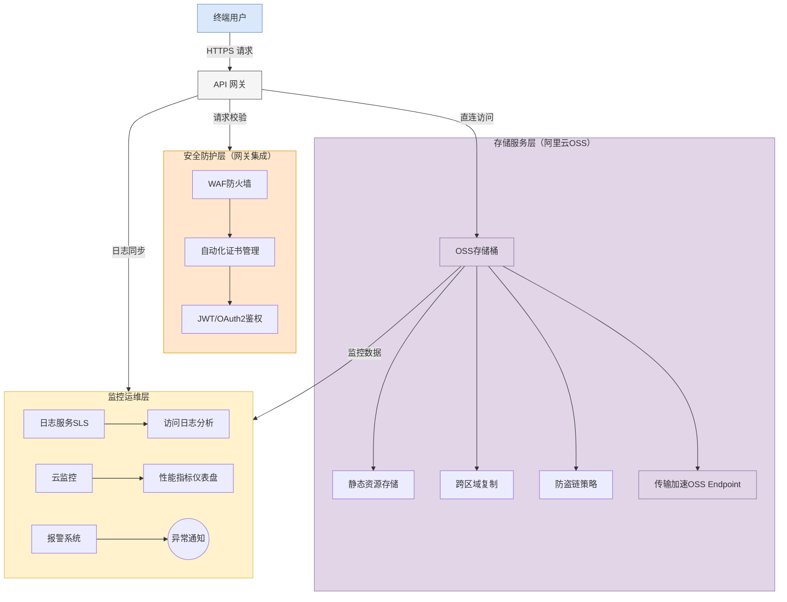

# 概述
本方案依托云原生 API 网关与阿里云对象存储 OSS（Object Storage Service）的深度集成，提供高性能、高可用、安全可靠的静态网站托管解决方案。通过API网关的智能流量调度能力与OSS的海量静态资源存储特性形成优势互补，实现资源托管、访问控制、加速分发、安全防护的全链路闭环，具备自动SSL证书管理、边缘节点缓存加速、精细化权限管控等核心优势。

### 场景描述
1. **资源托管**：用户将HTML/CSS/JS等静态文件上传至OSS Bucket
2. **网关路由**：通过API网关创建与OSS Bucket绑定的路由规则，配置自定义域名及HTTPS访问
3. **鉴权集成**：网关层实施JWT/OAuth2认证鉴权，OSS侧配置防盗链策略，形成双重防护
4. **终端访问**：用户请求通过API网关智能路由，经CDN加速节点访问OSS存储资源
5. **运维监控**：通过网关日志服务实时跟踪访问行为，结合OSS访问日志分析资源使用情况

### 应用场景
1. **企业级静态网站托管**  
适用于企业官网、产品文档中心等场景，通过API网关的全球加速能力与OSS的跨区域复制特性，实现毫秒级全球访问体验

2. **SPA单页应用托管**  
针对Vue/React等前端框架构建的单页应用，利用网关的路径重写能力实现History模式路由，结合OSS的冷热数据分层存储降低访问延迟

3. **大规模静态资源分发**  
适用于图片/视频流媒体、软件包分发等场景，通过网关的流量整形和OSS的传输加速服务，支撑百万级QPS的高并发访问

4. **混合云内容交付**  
对接线下IDC与云上OSS存储，通过网关的统一入口实现混合云架构下的资源整合，支持蓝绿发布、灰度分流等高级流量管理策略

### 解决问题
1. **传统托管部署复杂**  
   ▸ 替代传统Nginx+服务器文件系统的部署模式，实现Serverless架构下的全托管服务  
   ▸ 自动同步SSL证书更新，无需人工维护加密协议

2. **静态资源访问性能瓶颈**  
   ▸ 通过网关内置的CDN边缘缓存，降低OSS源站访问压力  
   ▸ 基于智能压缩算法实现静态资源自动Gzip/Brotli压缩

3. **安全防护体系薄弱**  
   ▸ WAF模块防御SQL注入、XSS等OWASP Top10攻击  
   ▸ 细粒度权限控制（IP黑白名单、Referer防盗链、临时访问令牌）

4. **动态扩展能力不足**  
   ▸ 网关实例自动弹性扩缩容，支撑突发流量最高可达10,000 TPS  
   ▸ OSS存储空间无上限自动扩展，单Bucket支持EB级数据存储

## 架构

